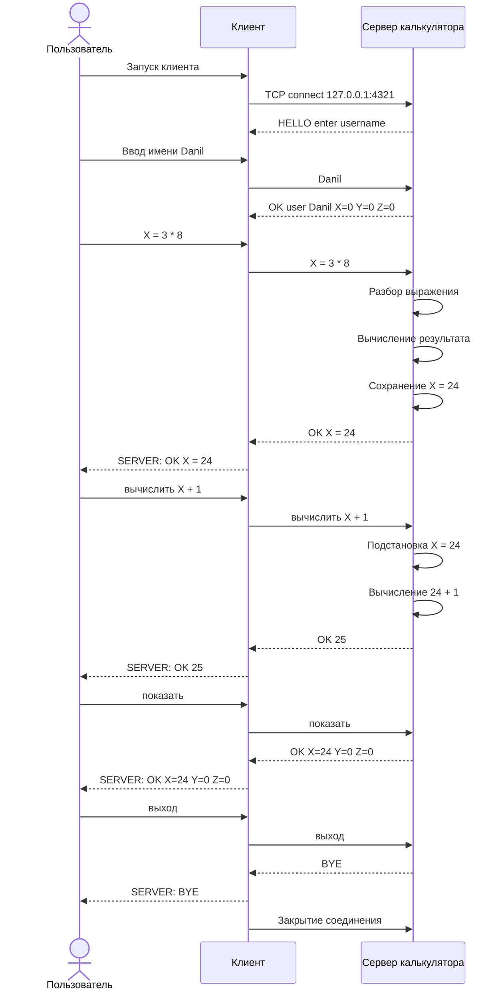

# Сетевой калькулятор с переменными X, Y, Z

Лабораторная работа: TCP клиент-серверное приложение с поддержкой пользовательских переменных `X`, `Y`, `Z`.

Сервер реализован как **однопроцессное однопоточное приложение**. Для одновременной работы с несколькими клиентами используются **неблокирующие сокеты** и системный вызов **`poll(2)`**.

---

## 1. Описание проекта

Проект состоит из двух частей:

- **клиент** — консольная программа, через которую пользователь вводит команды;
- **сервер** — программа, которая принимает TCP-подключения, хранит значения переменных пользователей и вычисляет выражения.

Клиент не выполняет вычисления самостоятельно. Он только отправляет команды на сервер и выводит полученный ответ.

Сервер для каждого пользователя хранит значения трёх переменных:

```text
X, Y, Z
```

Значения переменных сохраняются между подключениями пользователя. То есть если пользователь `Danil` задал `X = 24`, отключился, а потом снова подключился под именем `Danil`, сервер восстановит значение `X`.

---

## 2. Архитектура

Общая архитектура приложения:

```text
+-------------------+              TCP              +----------------------+
|                   | <---------------------------> |                      |
|      Клиент       |                               |        Сервер        |
|                   |                               |                      |
+-------------------+                               +----------------------+
        |                                                       |
        | ввод команд                                           |
        |                                                       |
        | "X = 3 * 8"                                           |
        |------------------------------------------------------>|
        |                                                       |
        |                                   разбор выражения    |
        |                                   вычисление          |
        |                                   сохранение X        |
        |                                                       |
        | "OK X = 24"                                           |
        |<------------------------------------------------------|
```

Файлы проекта:

```text
netcalc-lab/
├── CMakeLists.txt
└── src/
    ├── main.cpp          # точка входа, выбор режима server/client
    ├── server.hpp        # описание класса сервера
    ├── server.cpp        # сервер, poll(2), неблокирующие сокеты
    ├── client.hpp        # описание клиента
    ├── client.cpp        # консольный клиент
    ├── expression.hpp    # описание вычислителя выражений
    └── expression.cpp    # разбор и вычисление арифметических выражений
```

---

## 3. Сетевой протокол

### 3.1. Общая идея протокола

Протокол прикладного уровня построен поверх **TCP**.

Формат обмена — текстовый. Каждое сообщение передаётся отдельной строкой и заканчивается символом перевода строки:

```text
\n
```

Клиент отправляет серверу команды в виде строк. Сервер отвечает строкой с результатом.

Общий формат ответа сервера:

```text
OK <результат>
```

или

```text
ERR <описание ошибки>
```

Также при завершении работы сервер может отправить:

```text
BYE
```

---

### 3.2. Начало работы

После подключения сервер отправляет клиенту приветствие:

```text
HELLO enter username
```

Клиент отправляет имя пользователя:

```text
Danil
```

Сервер создаёт нового пользователя или загружает уже существующие значения переменных и отвечает:

```text
OK user Danil X=0 Y=0 Z=0
```

---

### 3.3. Команды клиента

#### Присваивание переменной

Формат:

```text
X = <выражение>
Y = <выражение>
Z = <выражение>
```

Пример:

```text
X = 3 * 8
```

Ответ:

```text
OK X = 24
```

---

#### Вычисление выражения без изменения переменных

Формат:

```text
вычислить <выражение>
```

Пример:

```text
вычислить X + 1
```

Ответ:

```text
OK 25
```

---

#### Просмотр переменных

Формат:

```text
показать
```

Ответ:

```text
OK X=24 Y=0 Z=0
```

---

#### Завершение работы клиента

Формат:

```text
выход
```

Ответ:

```text
BYE
```

---

#### Тест производительности

Для проверки производительности без разбора выражений используется команда:

```text
PING
```

Ответ:

```text
PONG
```

Эта команда нужна, чтобы измерять скорость сетевого обмена без затрат на вычисления и проверку корректности выражений.

---

## 4. Диаграмма последовательностей

Диаграмма взаимодействия клиента и сервера:



Или короче эту диаграмму можно представить так:

```text
Пользователь          Клиент                         Сервер
     |                  |                              |
     | запуск           |                              |
     |----------------->|                              |
     |                  | TCP connect                  |
     |                  |----------------------------->|
     |                  | HELLO enter username         |
     |                  |<-----------------------------|
     | имя Danil        |                              |
     |----------------->| Danil                        |
     |                  |----------------------------->|
     |                  | OK user Danil X=0 Y=0 Z=0    |
     |                  |<-----------------------------|
     | X = 3 * 8        |                              |
     |----------------->| X = 3 * 8                    |
     |                  |----------------------------->|
     |                  | OK X = 24                    |
     |                  |<-----------------------------|
     | вычислить X + 1  |                              |
     |----------------->| вычислить X + 1              |
     |                  |----------------------------->|
     |                  | OK 25                        |
     |                  |<-----------------------------|
     | показать         |                              |
     |----------------->| показать                     |
     |                  |----------------------------->|
     |                  | OK X=24 Y=0 Z=0              |
     |                  |<-----------------------------|
     | выход            |                              |
     |----------------->| выход                        |
     |                  |----------------------------->|
     |                  | BYE                          |
     |                  |<-----------------------------|
```

---

## 5. Неблокирующий ввод-вывод и poll(2)

Требование лабораторной работы:

> Сервер должен быть однопроцессным и однопоточным, использовать неблокирующие сокеты и `poll(2)`.

Это реализовано в файле:

```text
src/server.cpp
```

### 5.1. Подключение poll

В серверной части используется заголовочный файл:

```cpp
#include <poll.h>
```

### 5.2. Перевод сокетов в неблокирующий режим

Для перевода сокета в неблокирующий режим используется функция `fcntl` и флаг `O_NONBLOCK`:

```cpp
void setNonBlocking(int fd)
{
    int flags = fcntl(fd, F_GETFL, 0);
    if (flags == -1)
    {
        throw std::runtime_error("fcntl(F_GETFL) failed");
    }
    if (fcntl(fd, F_SETFL, flags | O_NONBLOCK) == -1)
    {
        throw std::runtime_error("fcntl(F_SETFL) failed");
    }
}
```

Эта функция вызывается для слушающего сокета сервера и для каждого нового клиентского сокета.

### 5.3. Главный цикл сервера

Сервер формирует список файловых дескрипторов и передаёт его в `poll`:

```cpp
std::vector<pollfd> fds;
fds.push_back({listenFd, POLLIN, 0});

for (auto &[fd, client] : clients)
{
    short events = POLLIN;
    if (!client.output.empty())
    {
        events |= POLLOUT;
    }
    fds.push_back({fd, events, 0});
}

int rc = poll(fds.data(), fds.size(), -1);
```

`poll` сообщает серверу, какие сокеты готовы к чтению или записи.

Если готов слушающий сокет, сервер принимает нового клиента.  
Если готов клиентский сокет, сервер читает команду или отправляет накопленный ответ.

### 5.4. Почему сервер однопроцессный и однопоточный

В сервере не используются:

```cpp
fork()
std::thread
pthread_create()
```

Все клиенты обслуживаются одним циклом `poll`.

---

## 6. Сборка проекта

```bash
mkdir -p build
cd build
cmake ..
cmake --build .
```

---

## 7. Запуск

В первом терминале запустить сервер:

```bash
./netcalc server 4321
```

Во втором терминале запустить клиента:

```bash
./netcalc client 127.0.0.1 4321
```

---

## 8. Пример работы

```text
SERVER: HELLO enter username
Введите имя пользователя: Danil
SERVER: OK user Danil X=0 Y=0 Z=0

Команды: X = 1+2, вычислить X*3, показать, выход

> X = 3*8
SERVER: OK X = 24

> вычислить X+1
SERVER: OK 25

> показать
SERVER: OK X=24 Y=0 Z=0

> выход
SERVER: BYE
```

---

## 9. Проверка ошибок

Пример деления на ноль:

```text
> X = 10 / 0
SERVER: ERR division by zero
```

Пример неизвестной переменной:

```text
> вычислить A + 1
SERVER: ERR unknown variable
```

---

## 10. Проверка производительности

Для тестирования производительности используется команда `PING`, которая не выполняет разбор и вычисление выражений.

Запуск клиента в режиме тестирования:

```bash
./netcalc client 127.0.0.1 4321 --perf 100000
```

Пример результата:

```text
Requests: 100000
Time: 1.25 sec
RPS: 80000
Average latency: 0.0125 ms
```

---
